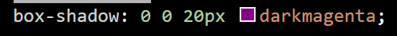

# Projeto - Formulário login

projeto criado como parte avaliativa da disciplina de Fundamentos de Desenvolvimento Web ministrada pelo professor Leonardo Rocha


## Índicie

* [Descrição](#descrição)
* [Tecnologias](#tecnologias)
* [Referências](#referências)
* [Autor](#autora)

### descrição

O projeto consiste na construção de uma tela de login, possibilitando o usuário a inserir seu e-mail e senha normalmente, porém sem realizar a entrada em um site.


### Resultado do projeto

#### Formulário

Foram usados os seguintes elementos:

* Div - Cria container com elementos dentro de si.
* Form - define o formulário e os atributos que definem a maneira como esse formulário se comporta
* H3 - Usado para inserir título no formulário.

Veja agora imagens dos elementos citados anteriormente:


Também foi utilizado:

* Label - Dá nome para a área de escrita, seja e-mail ou senha.
* Input -  Permite que o usuário escreva na página.
* Button -  Cria um botão clicável.

Segue a imagem ilustrativa:


Além dos elementos do HTML5, também foram usados as propriedades do CSS3. Segue aqui as utilizadas no projeto:

##### Cor

* Background-color - Altera a cor do fundo do projeto.


* Box-shadow - Adicona sombra ao fundo de um container presente na composição.



* Color - Foi usado par mudar a cor do testo do título da aba de login.


##### Texto

* Text-align - Alinha texto de acordo com a função colocada junto.


* Font-family - Muda a fonte do texto.


##### Outros

Todos os itens abaixo foram usados na aba do container.

* Display - Define comportamento dos elementos. Usado no Body e Container.
* Justify-content - usada para alinhar os elementos ao longo do eixo principal em horizontal.
* Align-items - Alinha os itens verticalmente
* Width - Largura aplicada na ciaxa do projeto.
* Height - Altura aplicada na caixa do projeto,

```
display: flex;
    justify-content: center;
    align-items: center;
    width: 100%;
    height: 100%;
```

Todos os elementos abaixo pertencem a aba do form:


* Padding - Afasta a borda (Padding-top apenas a define como afastar apenas a borda de cima.)
* Border-radius - Arredonda a borda da caixa de login do projeto.

```
padding: 30px;
    padding-top: 0;
    border-radius: 50px;
```

A seguir, ilustra a imagem do resultado final do projeto:


### Estilização

O projeto foi estilizado, utilizando CSS3. Foi criado um arquivo main.css. Nesse arquivo constam configurações de estlo apresentadas a seguir:

* Estilo de cores - A cor de fundo no projeto foi definida como segue:

```
.Form{
    background-color: pink;}
```

```
body{
    background-color:lightcoral;}
```

O elemento background-color foi utilizado con diferentes finalidades e cada parte do projeto, uma para definir o fundo total e outra como definição do fundo da caixa de login.


## Tecnologias

* HTML5
* CSS3
* README
* Git
* Github

## Referências

[Alura](https://www.alura.com.br/artigos/escrever-bom-readme) - Como escrever um README incrível no seu Github <br>
[w3school](https://www.w3schools.com/cssref/css3_pr_justify-content.php) - Explica como usar propriedade Justify-content e align-itens. Também possui explicações sobre outras propriedades CSS e HTML. <br>
[developer.mozilla CSS3](https://developer.mozilla.org/pt-BR/docs/Web/CSS/box-shadow) - Explica as demais propriedades CSS <br>
[developer.mozilla HTML5](https://developer.mozilla.org/pt-BR/docs/Web/HTML/Attributes) - Explica as demais propriedades HTML <br>


## Autora

O projeto foi desenvolvido por:

* Mariane Lima Remonte Viana.